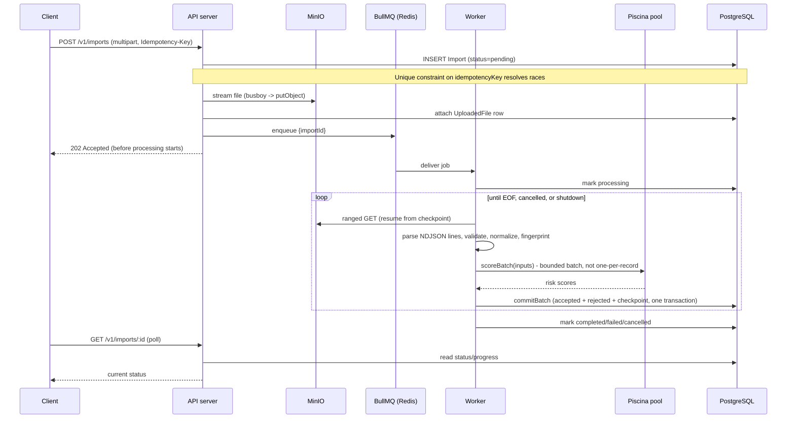

# Architecture

## 1. System Components

The system runs as two independent Node.js processes sharing three pieces of
infrastructure:

| Component | Role |
|---|---|
| **API server** (`server.ts`) | Express HTTP API. Accepts uploads, streams them to MinIO, enqueues processing jobs, and serves status/summary/rejection reads. Also serves `/health/*`, `/metrics`, and `/api-docs`. |
| **Worker** (`worker.ts`) | A BullMQ `Worker` that pulls import-processing jobs and runs them. Runs the CPU-heavy risk-scoring stage in a Piscina worker-thread pool, isolated from its own event loop. Exposes its own `/metrics` on a separate port. |
| **PostgreSQL** | The single source of truth for import status, progress, accepted transactions, and rejected records. Correctness (idempotency, duplicate detection, redelivery-safety) is enforced with database constraints, not in-memory state. |
| **Redis** | Backs BullMQ (job queue) and the app's own cache client. Two separate connections are used intentionally - BullMQ requires `ioredis`, while the app's general-purpose client uses `redis` - documented in [ADR-001](docs/adr/001-job-execution-model.md). |
| **MinIO** | S3-compatible object storage. Uploaded NDJSON files are streamed directly here; the worker reads them back via ranged GETs, which also enables resuming from a byte-offset checkpoint. |

Both processes are containerized (`Dockerfile`) and run via `docker-compose.yml`
alongside Postgres/Redis/MinIO, so `docker compose up --build` brings up the
entire system.

## 2. Module Boundaries and Dependency Direction

```
modules/
  auth/      controller, service, repository, routes, validation, openapi
  imports/   controller, service, repository, routes, validation, openapi,
             processor (worker-invoked batch engine), jobQueue, composition
  health/    controller, routes
shared/
  adapters/    concrete implementations of the ports below (Minio, Piscina,
               Pino, Prometheus, retry policy, system clock, UUID generator)
  ports/       interfaces business logic depends on (never the other way)
  services...  (folded into utils/ - see below)
  constants/   currency allowlist, HTTP status codes, error messages
  errors/      AppError and friends
  middleware/  authenticate, rate limiting, request ID, HTTP metrics
  state/       ReadinessState, ShutdownSignal (small in-process state machines)
  types/       Express request augmentation
  utils/       normalize, fingerprint, risk score, cursor encoding, NDJSON
               line parsing, JSON size capping, graceful shutdown
  validation/  Zod re-export, validate() middleware
config/        Prisma/Redis/MinIO client construction, OpenAPI registry
composition/   container.ts - the one place concrete adapters are assembled
```

**Dependency direction is one-way**: `modules/` may depend on `shared/` and
`config/`; `shared/` never depends on `modules/`. This was enforced concretely
during a refactor: `fingerprint.ts` needed the transaction shape, but instead
of importing the `imports` module's Zod-inferred `Transaction` type, it
defines a minimal local structural interface (`FingerprintFields`) - TypeScript's
structural typing lets the module's real type satisfy it with zero explicit
casting, and `shared/` stays import-free of any module.

Within `imports/`, interfaces are co-located with their primary concrete
implementation in the same file (e.g. `imports.repository.ts` exports both
the `ImportRepository` interface and `PrismaImportRepository`) rather than
kept in separate `ports/*.ts` files. This keeps the module flat (matching
`auth/`'s simpler style) without giving up dependency injection - callers still
depend on the interface type, not the concrete class.

## 3. Dependency Injection Strategy

Dependency injection is manual (no framework): every collaborator business
logic needs - repositories, file storage, the job queue, the risk scorer, the
clock, the ID generator, the logger, the metrics recorder, the retry policy -
is declared as a TypeScript interface under `shared/ports/` (or co-located, per
above) and injected via constructor parameters.

`src/composition/container.ts` is the single composition root: it constructs
every concrete adapter (Prisma client, Redis/ioredis clients, MinIO client,
Pino logger, prom-client registry) once and assembles them into a `Container`
object. `imports.composition.ts` then builds the actual use-case objects
(`ImportService`, `ImportProcessor`) from that container. Business logic
(`ImportService`, `ImportProcessor`) never imports Prisma, MinIO, or BullMQ
directly - it only sees the port interfaces.

This is exercised directly in tests: `test/unit/importService.test.ts` runs
`ImportService` against fully in-memory fakes (no database, no real I/O), and
`test/integration/helpers.ts` swaps only `FileStorage`/`JobQueue` for fakes
while keeping the real `PrismaImportRepository` against a real test database -
demonstrating the seam is real, not decorative.

## 4. Processing Workflow



Each stage is documented in code where the non-obvious decisions live:
- **Parsing**: `shared/utils/ndjsonLines.ts` - a streaming line splitter that
  handles empty lines, a final line without a trailing newline, and oversized
  lines without ever materializing the whole file.
- **Validation**: `imports.validation.ts` (Zod schema) - a validation failure
  becomes a `RejectedRecord`, never an infrastructure error, and never halts
  the import.
- **Normalization**: `shared/utils/normalize.ts` - trims strings, strips
  control characters (log-injection defense), uppercases currency, canonicalizes
  ISO-8601 timestamps to one representation, truncates descriptions.
- **Fingerprint**: `shared/utils/fingerprint.ts` - SHA-256 over a fixed,
  documented field order (`transactionId|accountId|merchantId|amount(2dp)|
  currency|timestamp`), versioned via `FINGERPRINT_VERSION`. Description is
  deliberately excluded - it doesn't affect transaction identity.
- **Risk scoring**: `shared/utils/riskScore.ts` - deterministic weighted score
  (amount 35%, hour-of-day 15%, description length 15%, merchant baseline 25%,
  fingerprint-derived jitter 10%), executed inside `shared/adapters/
  riskScoreWorker.ts` on the Piscina pool.
- **Persistence**: `imports.repository.ts`'s `commitBatch` - see §5.
- **Aggregation**: `getSummary` computes `byCurrency`/`byRiskLevel` via
  indexed `GROUP BY` queries against persisted transactions at read time,
  rather than maintaining running aggregates per currency/risk-level during
  processing. Chosen because the `Import` row's own running counters
  (`processedCount`/`acceptedCount`/etc.) already cover the frequently-polled
  progress endpoint cheaply; adding several more concurrently-updated
  aggregate counters would only pay off if `/summary` were polled as often as
  `/:id`, which it isn't - it's a trade-off of slightly heavier (but
  infrequent, indexed) summary reads for simpler, less contention-prone
  batch commits.

## 5. Database Consistency Strategy

Two constraints carry the correctness burden, not application code:

- **`Import.idempotencyKey` (unique)** - `createPendingImport` attempts an
  insert and translates a unique-violation into "someone already created this
  import"; the caller falls back to `findByIdempotencyKey`. This is race-safe
  under concurrent identical requests because Postgres serializes the
  conflicting inserts, not because of any application-level locking.
- **`Transaction.(providerId, transactionId)` (unique)** - `commitBatch`
  inserts accepted transactions via `createMany({ skipDuplicates: true })`,
  which uses `ON CONFLICT DO NOTHING` under the hood. This handles three
  distinct duplicate scenarios identically: duplicates against an
  already-committed row, duplicates within the same batch, and duplicates
  across two entirely separate import files for the same provider - the same
  provider is checked, so the same `transactionId` from two different
  providers is correctly not a duplicate.
- **What happens when the same transactionId is resubmitted with different
  content**: first-write-wins. The second submission is counted as a
  duplicate and its (different) field values are discarded, never silently
  overwriting the original. This is a deliberate, documented choice - the spec
  doesn't require reconciling conflicting resubmissions, and silently
  overwriting accepted financial data on a re-delivery would be worse than
  rejecting it.
- **Batch commit atomicity** - `commitBatch` runs entirely inside one
  `prisma.$transaction`: accepted-transaction inserts, rejected-record
  inserts, and the progress/checkpoint update either all land or none do. A
  crash between "records written" and "checkpoint advanced" cannot happen.
- **Redelivery guard** - `commitBatch` first checks whether
  `checkpointLineNumber` has already advanced past this batch's target line
  number; if so, it's a no-op. This makes replaying an already-committed
  batch (e.g. after a worker crash right after commit but before BullMQ
  registered the job as done) safe - it neither re-inserts rows nor
  double-increments the counters, which `skipDuplicates` alone would not
  protect (counters are increments, not naturally idempotent).

## 6. Retry Strategy

`shared/adapters/exponentialBackoffRetryPolicy.ts` wraps exactly one
operation: `commitBatch`'s database write (see `imports.repository.ts`'s
`isRetryableDbError`). Retryable errors are a narrow, explicit set of Prisma
error codes for connection/timeout/deadlock conditions
(`P1001, P1002, P1008, P1017, P2024, P2028, P2034`).

**Never retried**: validation failures (`RejectedRecord`s are a normal
outcome, not a failure), unique-constraint violations (a real duplicate, not
a transient condition), cancellation (`RetryAbortedError`), and anything not
in the explicit retryable set (programming errors surface immediately rather
than being silently absorbed).

- **Why retrying commitBatch is safe**: the redelivery guard in §5 makes a
  retried commit idempotent - re-running it after a transient failure either
  performs the write once (if it hadn't landed) or is a checkpoint-guarded
  no-op (if it actually had, and the "failure" was really a lost
  acknowledgment).
- **Retry storms** are bounded by `maxAttempts` (default 4) and avoided via
  jittered exponential backoff (`computeDelayMs`: capped exponential, ±50%
  jitter on top of a floor) rather than fixed-interval retries, which would
  synchronize retries from concurrent batches against the same struggling
  dependency.
- **After the final attempt fails**: the error propagates out of
  `commitBatch`, `ImportProcessor.process` catches it, marks the import
  `failed` with the error message as `failureReason`, and stops - it does not
  retry at the BullMQ level (jobs are configured with `attempts: 1`) since
  the DB-level retry already covers the retryable case, and re-running the
  whole job would mean reprocessing already-committed batches (safe, thanks
  to the checkpoint, but wasteful).
- **Metrics**: `retry_attempts_total`, `retry_exhausted_total`,
  `retry_aborted_total`, all labeled only by `operation` (never by import ID -
  see §9 on cardinality).

## 7. Cancellation Strategy

`POST /v1/imports/:id/cancel` sets `cancelRequested=true` and moves the
import to `cancelling` - it never touches `processing` state directly or
tries to interrupt an in-flight batch. The worker checks `cancelRequested` at
each batch boundary (not mid-batch, not per-record) and, on the next
boundary, marks the import `cancelled` and stops. This means cancellation is
not immediate but is always safe: a batch that's already being written
completes normally: no torn writes, no partially-committed record set left
in an ambiguous state.

Cancelling an import already in a terminal state (`completed`/`failed`/
`cancelled`) is a no-op that returns the existing status unchanged - it never
regresses a finished job back into a cancelling-looking state.

**Cancellation vs. shutdown**: cancellation is a per-import, user-requested,
permanent state transition recorded in the database. Shutdown (§8) is a
process-level, temporary signal - a shutdown does not mark any import
`cancelled`; the in-flight batch either finishes (and the import stays
`processing`, ready to be picked up again after restart) or the process exits
past its grace period leaving the import as-is, recoverable on the next
worker start since BullMQ will redeliver an unacknowledged job.

## 8. Graceful Shutdown Strategy

Both processes register the same handler shape
(`shared/utils/gracefulShutdown.ts`) for `SIGTERM`/`SIGINT`, running an
ordered list of steps with a hard grace-period backstop
(`SHUTDOWN_GRACE_PERIOD_MS`, default 30s):

**API server**: stop accepting new HTTP connections -> flip readiness false
(so `/health/ready` starts failing before the process actually stops, giving
a load balancer time to stop routing traffic) -> close HTTP server -> close
Prisma/Redis connections -> exit.

**Worker**: signal `ShutdownSignal.requestShutdown()` (checked by the
processor at the next batch boundary, same cooperative checkpoint mechanism
as cancellation) -> stop the BullMQ worker from pulling new jobs and wait for
the current invocation to return -> close the Piscina pool -> close the
metrics HTTP server -> disconnect Prisma/Redis/BullMQ's Redis connection ->
exit.

- **If the grace period expires**: the force-exit timer calls
  `process.exit(1)` - not silently, and never while a batch write is
  mid-flight, since each batch commit is one atomic transaction (either fully
  landed before the timer fires, or not started).
- **Is the current batch committed or rolled back?** Neither is forced - the
  in-flight `commitBatch` transaction either finishes normally (few seconds,
  well under the grace period in practice) or the process is killed and
  Postgres itself rolls back the uncommitted transaction. There's no
  half-written batch state possible.
- **Recovery of active jobs**: BullMQ's own stalled-job detection redelivers
  a job whose worker died without acknowledging it. The redelivered job
  resumes from `checkpointOffset`/`checkpointLineNumber`, and `commitBatch`'s
  guard (§5) makes reprocessing the last, possibly-already-committed batch
  safe.
- **New HTTP traffic during shutdown**: readiness flips to false immediately,
  before the HTTP server stops accepting connections - a well-behaved load
  balancer stops routing new requests during that window; requests already
  in flight are allowed to finish.

## 9. Duplicate-Detection Strategy

See §5 for the mechanism. The strategic point: correctness never depends on
any single process's memory. An in-memory `Set` of seen `transactionId`s
would fail across the required scenarios (different processes, restarts,
concurrent imports) by construction - only a database constraint holds across
all of them, which is why the unique index is the actual duplicate-detection
mechanism, and the application code that calls `skipDuplicates` is just
translating the database's answer into `acceptedCount`/`duplicateCount`.

## 10. Event-Loop Protection

- **What could block the event loop**: the risk-scoring algorithm
  deliberately simulates non-trivial CPU work (`CPU_SIMULATION_ITERATIONS =
  500` chained SHA-256 hashes per transaction in `shared/utils/riskScore.ts`).
  Run inline, scoring 500,000 transactions would visibly stall every HTTP
  request for the duration of the import.
- **How it's isolated**: `shared/adapters/PiscinaRiskScorer.ts` dispatches
  scoring to a Piscina worker-thread pool (`shared/adapters/
  riskScoreWorker.ts`), called in bounded batches (`scoreBatch`, one Piscina
  task per batch of up to 500 transactions - not one thread per transaction,
  not one thread per HTTP request). This amortizes per-task scheduling
  overhead across many records and keeps the number of concurrently
  in-flight worker tasks bounded by how many batches the processor chooses to
  have in flight, not by file size.
- **How blocking would be detected**: `nodejs_eventloop_lag_seconds` (from
  `prom-client`'s `collectDefaultMetrics`, backed by
  `perf_hooks.monitorEventLoopDelay()`) and a custom
  `nodejs_eventloop_utilization` gauge (`shared/adapters/
  eventLoopUtilization.ts`, backed by `performance.eventLoopUtilization()`),
  sampled continuously and exposed on `/metrics`.
- **Threshold intuition**: sustained event-loop lag in the tens of
  milliseconds or utilization consistently near 1.0 while HTTP p95 latency
  also degrades indicates the main thread itself is saturated - this is what
  the benchmark in `BENCHMARK.md` checks for directly (lag stayed under 25ms
  and utilization under 0.25 at 50k records while API p95 stayed under
  20ms).
- **CPU saturation vs. downstream I/O latency**: event-loop lag/utilization
  rising while HTTP latency also rises implicates the event loop itself
  (CPU-bound work on the main thread). If HTTP latency rises while
  event-loop utilization stays low, the bottleneck is downstream - Postgres
  connection pool exhaustion, MinIO/Redis round-trip time - not CPU. The
  benchmark script samples both signals simultaneously specifically to allow
  telling these apart.
- **Protecting latency-sensitive endpoints**: because risk scoring never runs
  on the main thread and batch DB writes are the only other
  meaningfully-costly operation (bounded to 500 rows, well within Postgres's
  comfortable range), `GET /health/live`, `/health/ready`, and the imports
  status/summary/rejections endpoints stay responsive throughout processing -
  confirmed empirically in the benchmark (p95 well under 20ms while a 50k-record
  import was actively processing).

## 11. Backpressure Strategy

| Limit | Where | Value |
|---|---|---|
| Max simultaneous imports processed | BullMQ `Worker` concurrency | 2 (`MAX_CONCURRENT_IMPORTS`) |
| Max DB rows per write | `commitBatch` batch size | 500 (`BATCH_SIZE` in `imports.processor.ts`) |
| Max risk-scoring batch | Piscina `scoreBatch` call | bounded to the same 500-record batch |
| Max upload size | Busboy `limits.fileSize` | 2 GiB default (`MAX_UPLOAD_BYTES`) |
| Max rejections page size | `/rejections?limit=` | 200 (`MAX_REJECTIONS_LIMIT`) |
| Retry attempts | `ExponentialBackoffRetryPolicy` | 4 (`DB_RETRY_MAX_ATTEMPTS`) |

Concurrency limits were chosen conservatively for a small (4-vCPU-class)
target environment: worker concurrency of 2 leaves headroom for the API
server and Piscina pool to run without contention; a batch size of 500 keeps
each transaction small enough to commit quickly (bounding how long a
cancellation or shutdown has to wait at a checkpoint) while being large
enough to amortize per-statement overhead.

**What happens at capacity**: the whole design leans on *bounded, not
rejected* work rather than a 429 response - a new import always gets a
`202` and a `pending` row immediately; if the worker is already at its
concurrency limit, BullMQ simply leaves the job `waiting` in the queue
(visible via the `import_queue_waiting` gauge) until a slot frees up. Queue
growth itself is naturally bounded by upstream realities (client upload
rate), not actively capped - a documented limitation, see `README.md`.

**Overload visibility**: `import_queue_waiting/active/delayed/failed` gauges
(polled from BullMQ every 5s) plus `active_imports` (worker-side gauge) make
queue backlog and worker saturation directly observable on `/metrics`.

## 12. Failure-Recovery Strategy / Delivery Guarantees

The system's delivery guarantee is **effectively-once**: BullMQ provides
at-least-once job delivery (a job can be redelivered after a stalled worker),
and the database constraints plus the checkpoint guard in `commitBatch` (§5)
make redelivery idempotent in effect - no duplicate rows, no double-counted
progress. This is deliberately not "exactly-once" (which would require
distributed-transaction coordination between BullMQ and Postgres) - it's the
standard, achievable "effectively-once through idempotent operations and
database constraints" pattern.
